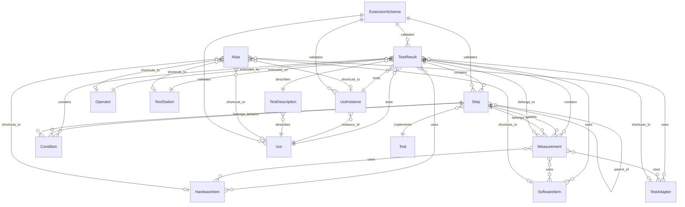

# NI DataStore Query Skill

This skill provides the complete, authoritative reference for querying data from NI Measurement Data
Services (MDS) using OData HTTP REST endpoints.

## When to Use This Skill

Trigger this skill when the user:
- Asks to **query, search, filter, or retrieve** data from the DataStore or MDS
- Asks about **test results, serial numbers, outcomes, measurement values, conditions, or steps** stored in MDS
- Wants to **review measurement data**, **look at test results**, or **examine test runs**
- Asks to **show me data**, **get data**, **pull data**, or any variation of requesting stored data
- Wants to **look up what ran** today, this week, or any date range
- Asks about **OData syntax** for MDS/DataStore
- Wants to **find failed results**, inspect a UUT, list operators, or browse hardware items
- Mentions `TestResults`, `Steps`, `Measurements`, `Conditions`, `UutInstances`, or `DataStore`
- Asks to **read back** data that was previously published to MDS
- Says "show me results", "what tests ran", "test run history", "measurement history", or similar phrases

## When NOT to Use This Skill

Do **not** use this skill when the user wants to **publish or write** data to MDS (create test results, steps, publish measurements). Use the `ni-measurement-data-services` skill instead — it covers the `DataStoreClient` and `MetadataStoreClient` write APIs.

## Key Rules

1. **Always use OData HTTP endpoints** for all queries — simple or complex. Base URL: `http://{host}:{port}/api/data-store/v1/odata`. Use `requests.get()` in Python to call them.
2. **Field names are PascalCase** in OData queries (e.g., `StartDateTime`, `UutInstanceId`, `SerialNumber`).
3. **Use `$expand` to resolve related entities** in a single call (e.g., `$expand=UutInstance($select=SerialNumber)`) rather than issuing separate queries.
4. **Date filter format**: ISO 8601 UTC — e.g., `StartDateTime ge {YYYY-MM-DD}T00:00:00Z`. Compute the current date at runtime; do not hardcode a date from this document.
5. **Outcome values are strings**: `$filter=Outcome eq 'Failed'` (not an integer or enum key).
6. **To get measurement values**: use `GetValue` (single) or `GetValues` (collection) — HTTP-only bound functions appended to the entity URL.
7. **Always look up `UutInstance.SerialNumber`** when the user asks about serial numbers — `TestResult` links to `UutInstanceId`, not directly to `SerialNumber`.

8. **PowerShell terminal escaping — prefer `Invoke-RestMethod`**: When executing OData queries in a PowerShell terminal, **always use native PowerShell `Invoke-RestMethod`** as the first choice. Escape `$` with a backtick (e.g., `` `$filter ``, `` `$orderby ``, `` `$select ``, `` `$expand ``, `` `$top ``). Pipe to `ConvertTo-Json -Depth 5` for readable output. The `&` character works fine inside double-quoted strings with `Invoke-RestMethod`. **Avoid `python -c` one-liners** for OData queries — they require `chr(36)` / `chr(38)` workarounds and are error-prone. Only fall back to a `.py` script file if the query logic is too complex for a single `Invoke-RestMethod` call.

## References

- [Data Entities Reference](./references/data-entities-reference.md)
- [MDS C# API](./references/MDS-CSharp-API.md)

---

# DataStore Data Entities Reference

This document describes all data entities in the DataStore service, their queryable fields, and relationships. These entities can be queried via OData syntax through both HTTP REST and gRPC endpoints.

## API Endpoints

### HTTP OData Endpoints

The primary way to query data is via HTTP OData endpoints:

**Base URL:** `http://{host}:{port}/api/data-store/v1/odata`

| Entity | Collection URL | Single Item URL |
|--------|----------------|-----------------|
| TestResults | `/TestResults` | `/TestResults/{guid}` |
| Steps | `/Steps` | `/Steps/{guid}` |
| Measurements | `/Measurements` | `/Measurements/{guid}` |
| Conditions | `/Conditions` | `/Conditions/{guid}` |
| Uuts | `/Uuts` | `/Uuts/{guid}` |
| UutInstances | `/UutInstances` | `/UutInstances/{guid}` |
| Operators | `/Operators` | `/Operators/{guid}` |
| Tests | `/Tests` | `/Tests/{guid}` |
| TestDescriptions | `/TestDescriptions` | `/TestDescriptions/{guid}` |
| TestStations | `/TestStations` | `/TestStations/{guid}` |
| HardwareItems | `/HardwareItems` | `/HardwareItems/{guid}` |
| SoftwareItems | `/SoftwareItems` | `/SoftwareItems/{guid}` |
| TestAdapters | `/TestAdapters` | `/TestAdapters/{guid}` |

**Example URLs:**

```
# Get all test results
GET http://localhost:42001/api/data-store/v1/odata/TestResults

# Get a specific measurement by ID
GET http://localhost:42001/api/data-store/v1/odata/Measurements/12345678-1234-1234-1234-123456789abc

# Query with OData filter
GET http://localhost:42001/api/data-store/v1/odata/TestResults?$filter=Outcome eq 'Failed'&$top=10
```

### Python SDK (Basic Queries)

For basic queries, use the `ni.datastore` Python SDK — see the [MDS Python API reference](./references/MDS-Python-API-Skill.md). The SDK methods (`query_test_results`, `query_steps`, `query_measurements`, `query_conditions`) accept an OData query string and return typed Python objects.

**Note:** The Python SDK (gRPC) does not support `$select`, `$expand`, or `$count`. Use the HTTP OData endpoints for those features.

### Special Functions (HTTP Only)

Measurements and Conditions support typed value-retrieval functions. All are bound functions — append to the entity URL.

#### Generic Value Functions (Measurement and Condition)

| Function | Single URL | Collection URL | Returns |
|----------|-----------|----------------|---------|
| `GetMoniker` | `/Measurements/{guid}/GetMoniker()` | `/Measurements/GetMonikers()` | Data reference token |
| `GetValue` | `/Measurements/{guid}/GetValue()` | `/Measurements/GetValues()` | Generic `Value` (any type) |
| `GetMoniker` | `/Conditions/{guid}/GetMoniker()` | `/Conditions/GetMonikers()` | Data reference token |
| `GetValue` | `/Conditions/{guid}/GetValue()` | `/Conditions/GetValues()` | Generic `Value` (any type) |

#### Typed Value Functions (use when you know the value type)

| Function | Applies To | Collection Variant | Return Type |
|----------|------------|-------------------|-------------|
| `GetBoolVector` | Measurement, Condition | `GetBoolVectors` | `BoolVectorValue` — `Data: bool[]` |
| `GetDoubleVector` | Measurement, Condition | `GetDoubleVectors` | `DoubleVectorValue` — `Data: double[]` |
| `GetInt32Vector` | Measurement, Condition | `GetInt32Vectors` | `Int32VectorValue` — `Data: int[]` |
| `GetStringVector` | Measurement, Condition | `GetStringVectors` | `StringVectorValue` — `Data: string[]` |
| `GetDoubleXY` | Measurement | `GetDoubleXYs` | `DoubleXYValue` — `XData: double[], YData: double[]` |
| `GetDoubleAnalogWaveform` | Measurement | `GetDoubleAnalogWaveforms` | `DoubleAnalogWaveformValue` — `YData: double[], T0, DT` |
| `GetDoubleComplexWaveform` | Measurement | `GetDoubleComplexWaveforms` | `DoubleComplexWaveformValue` — `Data: {Real, Imaginary}[], T0, DT` |
| `GetDoubleSpectrum` | Measurement | `GetDoubleSpectrums` | `DoubleSpectrumValue` — `Data: double[], StartFrequency, FrequencyIncrement` |
| `GetI16AnalogWaveform` | Measurement | `GetI16AnalogWaveforms` | `I16AnalogWaveformValue` — `Data: int[], Scale {Gain, Offset}, T0, DT` |
| `GetI16ComplexWaveform` | Measurement | `GetI16ComplexWaveforms` | `I16ComplexWaveformValue` — `Data: {Real, Imaginary}[], Scale, T0, DT` |
| `GetDigitalWaveform` | Measurement | `GetDigitalWaveforms` | `DigitalWaveformValue` — `YData: byte[], SignalCount, T0, DT` |

Collection functions support OData filtering:
```
/Measurements/GetValues()?$filter=Name eq 'Voltage'
/Measurements/GetDoubleVectors()?$filter=StepId eq 12345678-0000-0000-0000-000000000000
```

---

## OData Query Syntax

| Operation | Syntax | Example |
|-----------|--------|---------|
| Filter | `$filter=` | `$filter=Name eq 'Test1'` |
| Order | `$orderby=` | `$orderby=StartDateTime desc` |
| Skip | `$skip=` | `$skip=10` |
| Top | `$top=` | `$top=50` |
| Select | `$select=` | `$select=Name,Outcome` (HTTP only) |
| Expand | `$expand=` | `$expand=HardwareItems` (HTTP only) |
| Count | `$count=true` | Returns total count (HTTP only) |

### Filter Operators

| Operator | Description | Example |
|----------|-------------|---------|
| `eq` | Equals | `$filter=Outcome eq 'Passed'` |
| `ne` | Not equals | `$filter=Outcome ne 'Failed'` |
| `gt` | Greater than | `$filter=StartDateTime gt 2024-01-01T00:00:00Z` |
| `ge` | Greater or equal | `$filter=StartDateTime ge 2024-01-01T00:00:00Z` |
| `lt` | Less than | `$filter=EndDateTime lt 2024-12-31T23:59:59Z` |
| `le` | Less or equal | `$filter=EndDateTime le 2024-12-31T23:59:59Z` |
| `and` | Logical AND | `$filter=Outcome eq 'Passed' and Name eq 'Test1'` |
| `or` | Logical OR | `$filter=Outcome eq 'Passed' or Outcome eq 'Indeterminate'` |
| `not` | Logical NOT | `$filter=not (Outcome eq 'Failed')` |

### String Functions

| Function | Description | Example |
|----------|-------------|---------|
| `contains()` | Substring match | `$filter=contains(Name, 'voltage')` |
| `startswith()` | Prefix match | `$filter=startswith(Name, 'Test_')` |
| `endswith()` | Suffix match | `$filter=endswith(Name, '_v2')` |
| `tolower()` | Case-insensitive | `$filter=contains(tolower(Name), 'test')` |

---

## Query Construction Guidelines

### Performance Best Practices (Large Datasets)

When working with datasets that may contain thousands or millions of records:

1. **Use `$count` first** to understand dataset size before retrieving data.
2. **Use `$select`** to retrieve only needed fields: `$select=Name,Outcome`.
3. **Use `$top` with reasonable limits**: `$top=100` for exploration, `$top=1000` for larger analyses.
4. **Use `$skip` for pagination**: `$skip=100&$top=100` for the next page.
5. **Use `$apply` for aggregations**: `$apply=groupby((Name))` for unique values.
6. **For datasets >1000 records**: suggest pagination or more specific filters.
7. **For unique lists**: always use `$apply=groupby()` instead of retrieving all records.
8. **For related data**: use `$expand` instead of issuing separate queries.

### Critical OData Rules

**Never combine `$filter` with `$apply`** — these are mutually exclusive in OData. For filtering + aggregation, use the `filter()` function inside `$apply`:

- WRONG: `?$filter=Operator/Name eq 'alice'&$apply=groupby((Outcome))`
- CORRECT: `?$apply=filter(Operator/Name eq 'alice')/groupby((Outcome), aggregate($count as Count))`

**TestResults vs Tests**: `TestResults` are actual test runs (with names like suite or campaign names). `Tests` are test definitions. When the user says "tests" or searches by a test name, query `TestResults.Name`, not `Tests`.

**GUID/ID Handling**:
1. **Never quote GUIDs** — IDs are `Edm.Guid`, not `Edm.String`. This applies to **both** URL paths and `$filter` expressions:
   - URL path: `TestResults(9a4f2e7c-...)` — NOT `TestResults('9a4f2e7c-...')`
   - `$filter`: `$filter=TestResultId eq 9a4f2e7c-...` — NOT `$filter=TestResultId eq '9a4f2e7c-...'`
2. **Never reuse IDs from memory or previous responses** — always retrieve IDs from a fresh query before using them.

**ErrorInformation**: The `ErrorInformation` property cannot be used with `$select` or `$expand`. To access error information, omit `$select` entirely so the full entity is returned.

### Essential Query Patterns

**Counting** — use `/$count`:
```
Measurements/$count
Measurements/$count?$filter=Outcome eq 'Passed'
```

**Ordering (temporal queries)** — use `$orderby`. Without `$orderby`, results are in arbitrary order, NOT chronological:
```
Measurements?$orderby=StartDateTime desc&$top=10    # latest/most recent
Measurements?$orderby=StartDateTime asc&$top=10     # first/earliest
```

**Unique values** — use `$apply=groupby()`:
```
Measurements?$apply=groupby((Name))     # unique measurement names
Operators?$apply=groupby((Name))        # unique operator names
```

**Filtered aggregations** — use `$apply=filter()/groupby()`:
```
Measurements?$apply=filter(Operator/Name eq 'alice')/groupby((Outcome), aggregate($count as Count))
Measurements?$apply=filter(Outcome eq 'Passed')/groupby((Operator/Name), aggregate($count as Count))
```

**Filtering with navigation properties**:
```
Measurements?$filter=Operator/Name eq 'Christophe'
TestStations?$filter=TestResults/any(s: s/Operator/Name eq 'John')
```

### Using $expand with $select

Use `$expand` with `$select` to resolve IDs to names without extra queries. Only include direct properties of the root entity in the root `$select` — do NOT include navigation property paths like `Operator/Name` in the root `$select`:

```
# Correct — expand navigation properties with their own $select
Measurements?$expand=Operator($select=Name),UutInstance($select=SerialNumber)&$select=Id,Name,Outcome&$top=100

# Correct — nested navigation under a parent expand (semicolons separate options inside a navigation property)
Steps?$expand=TestResult($select=Outcome;$expand=UutInstance($select=SerialNumber))

# Correct — multiple sibling expands inside the same parent
Steps?$expand=TestResult($expand=Operator($select=Name),UutInstance($select=SerialNumber))
```

**Common mistake — sibling expands placed outside the parent's parentheses:**
- WRONG: `?$expand=TestResult($expand=Operator($select=Name)),UutInstance($select=SerialNumber)` — this tries to expand `UutInstance` at the root, not under `TestResult`.
- CORRECT: `?$expand=TestResult($expand=Operator($select=Name),UutInstance($select=SerialNumber))` — both expanded under `TestResult`.

### Fuzzy Text Matching Strategy

When the user provides a name or text string (operator names, test names, serial numbers, etc.), use this cascading strategy. Do not ask for clarification until all steps have been tried.

**Step 1: Case-insensitive exact match**
```
Operators?$filter=tolower(Name) eq 'alice williams'
```

**Step 2: Multi-token contains** — if Step 1 returns zero results, split into tokens and use `contains()` on each. Filter out entity-type words (e.g., remove "operator" when querying Operators, "station" for TestStations, "hardware"/"item" for HardwareItems):
```
Operators?$filter=contains(tolower(Name), 'alice') and contains(tolower(Name), 'williams')
```
- For brand/manufacturer names (e.g., "Keysight", "NI"), search the `Manufacturer` field, not `Model`.
- For operator role queries (e.g., "quality engineer"), also search the `Role` field if `Name` returns nothing.

**Step 3: Single distinctive token** — if Step 2 returns zero results, use the most distinctive token (usually last name or longest word):
```
Operators?$filter=contains(tolower(Name), 'williams')
```

**Step 4: Page through records** — if Step 3 returns zero results, paginate through records in pages of 100, up to a cap of 500 total, and manually inspect for similar matches:
```
Operators?$select=Id,Name&$top=100
Operators?$select=Id,Name&$top=100&$skip=100
```
Look for partial matches, transposed letters, similar spellings, or alternate formats. For serial numbers/part numbers, query BOTH `UutInstances` AND `HardwareItems`.

**Handling multiple matches**: If 2–4 matches are found, present all and ask if the user wants results from all or a specific one. If >5 matches, list them and ask the user to be more specific. Do not arbitrarily pick one.

### Query Strategy by Question Type

| User Question Pattern | Strategy | Example |
|---|---|---|
| "What's the latest/most recent…?" | `$orderby=StartDateTime desc` + `$top` | `Measurements?$orderby=StartDateTime desc&$top=1` |
| "What's the first/earliest…?" | `$orderby=StartDateTime asc` + `$top` | `Measurements?$orderby=StartDateTime asc&$top=1` |
| "Show breakdown by…" | `$apply=filter()/groupby()` | `Measurements?$apply=filter(…)/groupby((Outcome), aggregate($count as Count))` |
| "What are the [entity names]?" | `$apply=groupby()` | `Operators?$apply=groupby((Name))` |
| "How many…?" | `/$count` | `Measurements/$count?$filter=Outcome eq 'Passed'` |
| "List measurements with details" | `$expand` + `$select` | `Measurements?$expand=Operator($select=Name)&$select=Id,Name,Outcome` |
| "Explore large dataset" | Count first, then paginate | `Measurements/$count` → `Measurements?$select=…&$top=100` |

### Measurement ValueTypes

When retrieving measurement data, match the request to the closest protobuf type:

| Type URL | Description |
|---|---|
| `type.googleapis.com/ni.protobuf.types.Scalar` | Single scalar value |
| `type.googleapis.com/ni.protobuf.types.Vector` | 1-D array |
| `type.googleapis.com/ni.protobuf.types.DoubleAnalogWaveform` | Analog waveform |
| `type.googleapis.com/ni.protobuf.types.DoubleXYData` | X-Y paired data |
| `type.googleapis.com/ni.protobuf.types.I16AnalogWaveform` | 16-bit analog waveform |
| `type.googleapis.com/ni.protobuf.types.DoubleComplexWaveform` | Complex waveform |
| `type.googleapis.com/ni.protobuf.types.I16ComplexWaveform` | 16-bit complex waveform |
| `type.googleapis.com/ni.protobuf.types.DoubleSpectrum` | Spectrum data |
| `type.googleapis.com/ni.protobuf.types.DigitalWaveform` | Digital waveform |

---

## Core Entities

### TestResult

The top-level entity representing a complete test execution session.

**HTTP:** `GET /api/data-store/v1/odata/TestResults`  
**gRPC:** `QueryTestResults`

| Field | Type | Description | Queryable |
|-------|------|-------------|-----------|
| `Id` | `Guid` | Unique identifier | ✓ |
| `Name` | `string` | Test result name | ✓ |
| `StartDateTime` | `DateTime?` | When the test started | ✓ |
| `EndDateTime` | `DateTime?` | When the test ended | ✓ |
| `Outcome` | `Outcome` | Pass/Fail/etc. status | ✓ |
| `Link` | `string?` | External reference URL | ✓ |
| `SchemaId` | `string?` | Schema for validation | ✓ |
| `StatusAggregationMode` | `int` | How child statuses aggregate | ✓ |
| `UutId` | `Guid?` | Direct UUT type link (without instance) | ✓ |
| `PathId` | `Guid?` | Path entity reference | ✓ |
| `Extension` | `object` | Custom JSON properties | ✓ (see Extension Queries) |
| `ErrorInformation` | `object?` | Error details: `ErrorCode` (int), `Message` (string), `Source` (string) | ✓ |

**Relationships:**

| Navigation | Target Entity | Cardinality |
|------------|---------------|-------------|
| `UutInstance` | UutInstance | Many-to-One |
| `Uut` | Uut | Many-to-One |
| `Operator` | Operator | Many-to-One |
| `TestDescription` | TestDescription | Many-to-One |
| `TestStation` | TestStation | Many-to-One |
| `HardwareItems` | HardwareItem | Many-to-Many |
| `SoftwareItems` | SoftwareItem | Many-to-Many |
| `TestAdapters` | TestAdapter | Many-to-Many |
| `Steps` | Step | One-to-Many |
| `Measurements` | Measurement | One-to-Many |
| `Conditions` | Condition | One-to-Many |

---

### Step

Represents a discrete step or phase within a test execution.

**HTTP:** `GET /api/data-store/v1/odata/Steps`  
**gRPC:** `QuerySteps`

| Field | Type | Description | Queryable |
|-------|------|-------------|-----------|
| `Id` | `Guid` | Unique identifier | ✓ |
| `TestResultId` | `Guid` | Parent test result | ✓ |
| `TestId` | `Guid?` | Associated test definition | ✓ |
| `ParentStepId` | `Guid?` | Parent step (for nested steps) | ✓ |
| `Name` | `string` | Step name | ✓ |
| `StepType` | `string?` | Type classification | ✓ |
| `Notes` | `string?` | User notes | ✓ |
| `Link` | `string?` | External reference URL | ✓ |
| `StartDateTime` | `DateTime?` | When the step started | ✓ |
| `EndDateTime` | `DateTime?` | When the step ended | ✓ |
| `Outcome` | `Outcome` | Pass/Fail/etc. status | ✓ |
| `StatusAggregationMode` | `int` | How child statuses aggregate | ✓ |
| `SchemaId` | `string?` | Schema for validation | ✓ |
| `Extension` | `object` | Custom JSON properties | ✓ |
| `ErrorInformation` | `object?` | Error details: `ErrorCode` (int), `Message` (string), `Source` (string) | ✓ |

**Relationships:**

| Navigation | Target Entity | Cardinality |
|------------|---------------|-----------|
| `TestResult` | TestResult | Many-to-One |
| `Test` | Test | Many-to-One |
| `ParentStep` | Step | Many-to-One (self-referential) |
| `ChildSteps` | Step | One-to-Many (self-referential) |
| `Measurements` | Measurement | One-to-Many |
| `Conditions` | Condition | One-to-Many |

---

### Measurement

Represents a single measurement data point or collection within a step.

**HTTP:** `GET /api/data-store/v1/odata/Measurements`  
**gRPC:** `QueryMeasurements`

| Field | Type | Description | Queryable |
|-------|------|-------------|-----------|
| `Id` | `Guid` | Unique identifier | ✓ |
| `StepId` | `Guid` | Parent step | ✓ |
| `TestResultId` | `Guid` | Parent test result | ✓ |
| `Name` | `string` | Measurement name | ✓ |
| `ValueType` | `string` | Data type URL | ✓ |
| `ParametricIndex` | `int?` | Index for parametric data | ✓ |
| `Notes` | `string?` | User notes | ✓ |
| `StartDateTime` | `DateTime?` | When measurement started | ✓ |
| `EndDateTime` | `DateTime?` | When measurement ended | ✓ |
| `Outcome` | `Outcome` | Pass/Fail/etc. status | ✓ |
| `PathId` | `Guid?` | Path entity reference | ✓ |
| `CreatedUtcTicks` | `Int64` | Creation timestamp (UTC ticks) | ✓ |
| `ErrorInformation` | `object?` | Error details: `ErrorCode` (int), `Message` (string), `Source` (string) | ✓ |

**Relationships:**

| Navigation | Target Entity | Cardinality |
|------------|---------------|-------------|
| `Step` | Step | Many-to-One |
| `TestResult` | TestResult | Many-to-One |
| `UutInstance` | UutInstance | Many-to-One |
| `Uut` | Uut | Many-to-One |
| `Operator` | Operator | Many-to-One |
| `Test` | Test | Many-to-One |
| `TestDescription` | TestDescription | Many-to-One |
| `TestStation` | TestStation | Many-to-One |
| `HardwareItems` | HardwareItem | Many-to-Many |
| `SoftwareItems` | SoftwareItem | Many-to-Many |
| `TestAdapters` | TestAdapter | Many-to-Many |

---

### Condition

Represents a test condition or environmental parameter associated with a step.

**HTTP:** `GET /api/data-store/v1/odata/Conditions`  
**gRPC:** `QueryConditions`

| Field | Type | Description | Queryable |
|-------|------|-------------|-----------|
| `Id` | `Guid` | Unique identifier | ✓ |
| `StepId` | `Guid` | Parent step | ✓ |
| `TestResultId` | `Guid` | Parent test result | ✓ |
| `Name` | `string` | Condition name | ✓ |
| `ConditionType` | `string?` | Type classification | ✓ |
| `PathId` | `Guid?` | Path entity reference | ✓ |

**Relationships:**

| Navigation | Target Entity | Cardinality |
|------------|---------------|-------------|
| `Step` | Step | Many-to-One |
| `TestResult` | TestResult | Many-to-One |

---

## Context Entities

### Uut (Unit Under Test)

Represents a product model or type being tested.

**HTTP:** `GET /api/data-store/v1/odata/Uuts`

| Field | Type | Description | Queryable |
|-------|------|-------------|-----------|
| `Id` | `Guid` | Unique identifier | ✓ |
| `ModelName` | `string?` | Product model name | ✓ |
| `PartNumber` | `string?` | Part number | ✓ |
| `Family` | `string?` | Product family | ✓ |
| `Link` | `string?` | External reference URL | ✓ |
| `Manufacturers` | `string[]?` | List of manufacturers | ✓ |
| `SchemaId` | `string?` | Schema for validation | ✓ |
| `Extension` | `object` | Custom JSON properties | ✓ |

---

### UutInstance

Represents a specific instance/unit of a UUT (by serial number).

**HTTP:** `GET /api/data-store/v1/odata/UutInstances`

| Field | Type | Description | Queryable |
|-------|------|-------------|-----------|
| `Id` | `Guid` | Unique identifier | ✓ |
| `UutId` | `Guid?` | Parent UUT type | ✓ |
| `SerialNumber` | `string?` | Unit serial number | ✓ |
| `ManufactureDate` | `string?` | Manufacturing date | ✓ |
| `FirmwareVersion` | `string?` | Firmware version | ✓ |
| `HardwareVersion` | `string?` | Hardware revision | ✓ |
| `Link` | `string?` | External reference URL | ✓ |
| `SchemaId` | `string?` | Schema for validation | ✓ |
| `Extension` | `object` | Custom JSON properties | ✓ |

---

### Operator

Represents a user or operator who executed a test.

**HTTP:** `GET /api/data-store/v1/odata/Operators`

| Field | Type | Description | Queryable |
|-------|------|-------------|-----------|
| `Id` | `Guid` | Unique identifier | ✓ |
| `Name` | `string?` | Operator name | ✓ |
| `Role` | `string?` | Operator role | ✓ |
| `Link` | `string?` | External reference URL | ✓ |
| `SchemaId` | `string?` | Schema for validation | ✓ |
| `Extension` | `object` | Custom JSON properties | ✓ |

---

### Test

Represents a test definition or procedure.

**HTTP:** `GET /api/data-store/v1/odata/Tests`

| Field | Type | Description | Queryable |
|-------|------|-------------|-----------|
| `Id` | `Guid` | Unique identifier | ✓ |
| `Name` | `string?` | Test name | ✓ |
| `Description` | `string?` | Test description | ✓ |
| `Link` | `string?` | External reference URL | ✓ |
| `SchemaId` | `string?` | Schema for validation | ✓ |
| `Extension` | `object` | Custom JSON properties | ✓ |

---

### TestDescription

Represents test documentation or specification.

**HTTP:** `GET /api/data-store/v1/odata/TestDescriptions`

| Field | Type | Description | Queryable |
|-------|------|-------------|-----------|
| `Id` | `Guid` | Unique identifier | ✓ |
| `UutId` | `Guid?` | Associated UUT | ✓ |
| `Name` | `string?` | Description name | ✓ |
| `Link` | `string?` | External reference URL | ✓ |
| `SchemaId` | `string?` | Schema for validation | ✓ |
| `Extension` | `object` | Custom JSON properties | ✓ |

---

### TestStation

Represents a test system or workstation.

**HTTP:** `GET /api/data-store/v1/odata/TestStations`

| Field | Type | Description | Queryable |
|-------|------|-------------|-----------|
| `Id` | `Guid` | Unique identifier | ✓ |
| `Name` | `string?` | Station name | ✓ |
| `AssetIdentifier` | `string?` | Asset tag or ID | ✓ |
| `Link` | `string?` | External reference URL | ✓ |
| `SchemaId` | `string?` | Schema for validation | ✓ |
| `Extension` | `object` | Custom JSON properties | ✓ |

---

## Metadata Entities

### Aliases

Named shortcuts to any entity in the DataStore. Allows referencing entities by a human-readable name instead of GUID.

**HTTP:** `GET /api/data-store/v1/odata/Aliases`

| Field | Type | Description | Queryable |
|-------|------|-------------|----------|
| `Name` | `string` (key) | Alias name (unique identifier) | ✓ |
| `TargetType` | `AliasTargetType` | Type of entity being aliased | ✓ |
| `TargetId` | `Guid` | ID of the target entity | ✓ |

**AliasTargetType enum values:**

| Value | Target Entity |
|-------|---------------|
| `Unspecified` | Not specified |
| `UutInstance` | UutInstance |
| `Uut` | Uut |
| `HardwareItem` | HardwareItem |
| `SoftwareItem` | SoftwareItem |
| `Operator` | Operator |
| `TestDescription` | TestDescription |
| `Test` | Test |
| `TestStation` | TestStation |
| `TestAdapter` | TestAdapter |

---

### ExtensionSchemas

JSON schemas used to validate the `Extension` property on entities.

**HTTP:** `GET /api/data-store/v1/odata/ExtensionSchemas`

| Field | Type | Description | Queryable |
|-------|------|-------------|----------|
| `Id` | `string` (key) | Schema identifier | ✓ |
| `Schema` | `string` | JSON schema content | ✓ |
| `OriginalSchema` | `string?` | Original unprocessed schema | ✓ |

Entities link to a schema via their `SchemaId` field. Use `$expand=Schema` (HTTP only) to retrieve the schema inline.

---

## Equipment Entities

### HardwareItem

Represents test equipment or instrumentation.

**HTTP:** `GET /api/data-store/v1/odata/HardwareItems`

| Field | Type | Description | Queryable |
|-------|------|-------------|-----------|
| `Id` | `Guid` | Unique identifier | ✓ |
| `Manufacturer` | `string?` | Equipment manufacturer | ✓ |
| `Model` | `string?` | Equipment model | ✓ |
| `SerialNumber` | `string?` | Serial number | ✓ |
| `PartNumber` | `string?` | Part number | ✓ |
| `AssetIdentifier` | `string?` | Asset tag | ✓ |
| `CalibrationDueDate` | `string?` | Calibration expiry | ✓ |
| `Link` | `string?` | External reference URL | ✓ |
| `SchemaId` | `string?` | Schema for validation | ✓ |
| `Extension` | `object` | Custom JSON properties | ✓ |

---

### SoftwareItem

Represents software used during testing.

**HTTP:** `GET /api/data-store/v1/odata/SoftwareItems`

| Field | Type | Description | Queryable |
|-------|------|-------------|-----------|
| `Id` | `Guid` | Unique identifier | ✓ |
| `Product` | `string?` | Software product name | ✓ |
| `Version` | `string?` | Software version | ✓ |
| `Link` | `string?` | External reference URL | ✓ |
| `SchemaId` | `string?` | Schema for validation | ✓ |
| `Extension` | `object` | Custom JSON properties | ✓ |

---

### TestAdapter

Represents test fixtures or adapters.

**HTTP:** `GET /api/data-store/v1/odata/TestAdapters`

| Field | Type | Description | Queryable |
|-------|------|-------------|-----------|
| `Id` | `Guid` | Unique identifier | ✓ |
| `Name` | `string?` | Adapter name | ✓ |
| `Manufacturer` | `string?` | Adapter manufacturer | ✓ |
| `Model` | `string?` | Adapter model | ✓ |
| `SerialNumber` | `string?` | Serial number | ✓ |
| `PartNumber` | `string?` | Part number | ✓ |
| `AssetIdentifier` | `string?` | Asset tag | ✓ |
| `CalibrationDueDate` | `string?` | Calibration expiry | ✓ |
| `Link` | `string?` | External reference URL | ✓ |
| `SchemaId` | `string?` | Schema for validation | ✓ |
| `Extension` | `object` | Custom JSON properties | ✓ |

---

## Extension Queries

Entities with an `Extension` property support querying custom JSON fields. The syntax uses the field path within the JSON:

```
$filter=Extension/customField eq 'value'
```

For nested properties:

```
$filter=Extension/parent/child eq 'value'
```

---

## Outcome Enum Values

The `Outcome` field uses these values (sourced from live `$metadata`):

| Value | Int | Description |
|-------|-----|-------------|
| `Unspecified` | 0 | No outcome set |
| `Passed` | 1 | Test passed |
| `Failed` | 2 | Test failed |
| `Indeterminate` | 3 | Inconclusive result |

> **Note:** Only these 4 values exist in the service. Do not use Running, Skipped, Errored, Terminated, Done, or Custom — they are not valid.

---

## Entity Relationship Diagram



---

## Example Queries

All examples show the query string portion. Prepend with the base URL:
`http://localhost:42001/api/data-store/v1/odata/{EntitySet}?{query}`

### Find all failed test results from today

Replace `{TODAY}` with today's UTC midnight in ISO 8601 format (e.g., `2026-04-22T00:00:00Z`):

```
GET /api/data-store/v1/odata/TestResults?$filter=Outcome eq 'Failed' and StartDateTime ge {TODAY}
```

### Find test results by UUT instance ID

```
GET /api/data-store/v1/odata/TestResults?$filter=UutInstanceId eq 12345678-1234-1234-1234-123456789abc
```

### Find measurements with a specific name pattern

```
GET /api/data-store/v1/odata/Measurements?$filter=contains(Name, 'Voltage') and Outcome eq 'Passed'
```

### Get the 10 most recent test results

```
GET /api/data-store/v1/odata/TestResults?$orderby=StartDateTime desc&$top=10
```

### Find steps of a specific type within a test result

```
GET /api/data-store/v1/odata/Steps?$filter=TestResultId eq 12345678-1234-1234-1234-123456789abc and StepType eq 'Verification'
```

### Query by custom extension field

```
GET /api/data-store/v1/odata/TestResults?$filter=Extension/batchId eq 'BATCH-2024-001'
```

### Expand related entities (HTTP only)

```
GET /api/data-store/v1/odata/TestResults?$expand=HardwareItems,SoftwareItems&$top=5
```

### Select specific fields (HTTP only)

```
GET /api/data-store/v1/odata/TestResults?$select=Id,Name,Outcome,StartDateTime&$top=20
```
