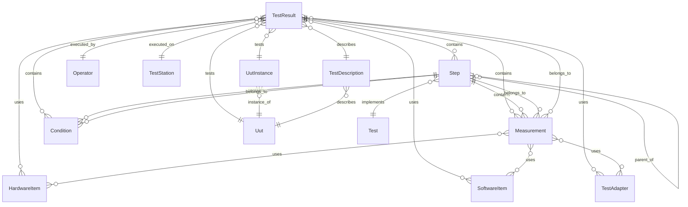

# DataStore Data Entities Reference

This document describes all data entities in the DataStore service, their queryable fields, and relationships. These entities can be queried via OData syntax through both HTTP REST and gRPC endpoints.

## API Endpoints

### HTTP OData Endpoints

The primary way to query data is via HTTP OData endpoints:

**Base URL:** `http://{host}:{port}/api/data-store/v1/odata`

| Entity | Collection URL | Single Item URL |
|--------|----------------|-----------------|
| TestResults | `/TestResults` | `/TestResults/{guid}` |
| Steps | `/Steps` | `/Steps/{guid}` |
| Measurements | `/Measurements` | `/Measurements/{guid}` |
| Conditions | `/Conditions` | `/Conditions/{guid}` |
| Uuts | `/Uuts` | `/Uuts/{guid}` |
| UutInstances | `/UutInstances` | `/UutInstances/{guid}` |
| Operators | `/Operators` | `/Operators/{guid}` |
| Tests | `/Tests` | `/Tests/{guid}` |
| TestDescriptions | `/TestDescriptions` | `/TestDescriptions/{guid}` |
| TestStations | `/TestStations` | `/TestStations/{guid}` |
| HardwareItems | `/HardwareItems` | `/HardwareItems/{guid}` |
| SoftwareItems | `/SoftwareItems` | `/SoftwareItems/{guid}` |
| TestAdapters | `/TestAdapters` | `/TestAdapters/{guid}` |

**Example URLs:**

```
# Get all test results
GET http://localhost:42001/api/data-store/v1/odata/TestResults

# Get a specific measurement by ID
GET http://localhost:42001/api/data-store/v1/odata/Measurements/12345678-1234-1234-1234-123456789abc

# Query with OData filter
GET http://localhost:42001/api/data-store/v1/odata/TestResults?$filter=Outcome eq 'Failed'&$top=10
```

### gRPC Query Endpoints

For programmatic access, gRPC `Query*` methods accept an `odata_query` string:

| Method | Request Type | Description |
|--------|--------------|-------------|
| `QueryTestResults` | `QueryTestResultsRequest` | Query test results |
| `QuerySteps` | `QueryStepsRequest` | Query steps |
| `QueryMeasurements` | `QueryMeasurementsRequest` | Query measurements |
| `QueryConditions` | `QueryConditionsRequest` | Query conditions |

**Note:** gRPC queries do not support `$select`, `$expand`, or `$count` (HTTP OData endpoints do).

### Special Functions (HTTP Only)

Measurements and Conditions support additional functions for accessing their data values:

| Entity | Function | URL Pattern | Description |
|--------|----------|-------------|-------------|
| Measurements | `GetMoniker` | `/Measurements/{guid}/GetMoniker()` | Get data reference token |
| Measurements | `GetValue` | `/Measurements/{guid}/GetValue()` | Get measurement value |
| Measurements | `GetMonikers` | `/Measurements/GetMonikers()` | Get monikers for filtered collection |
| Measurements | `GetValues` | `/Measurements/GetValues()` | Get values for filtered collection |
| Conditions | `GetMoniker` | `/Conditions/{guid}/GetMoniker()` | Get data reference token |
| Conditions | `GetValue` | `/Conditions/{guid}/GetValue()` | Get condition value |
| Conditions | `GetMonikers` | `/Conditions/GetMonikers()` | Get monikers for filtered collection |
| Conditions | `GetValues` | `/Conditions/GetValues()` | Get values for filtered collection |

Collection functions support OData filtering: `/Measurements/GetValues()?$filter=Name eq 'Voltage'`

---

## OData Query Syntax

| Operation | Syntax | Example |
|-----------|--------|---------|
| Filter | `$filter=` | `$filter=Name eq 'Test1'` |
| Order | `$orderby=` | `$orderby=StartDateTime desc` |
| Skip | `$skip=` | `$skip=10` |
| Top | `$top=` | `$top=50` |
| Select | `$select=` | `$select=Name,Outcome` (HTTP only) |
| Expand | `$expand=` | `$expand=HardwareItems` (HTTP only) |
| Count | `$count=true` | Returns total count (HTTP only) |

### Filter Operators

| Operator | Description | Example |
|----------|-------------|---------|
| `eq` | Equals | `$filter=Outcome eq 'Passed'` |
| `ne` | Not equals | `$filter=Outcome ne 'Failed'` |
| `gt` | Greater than | `$filter=StartDateTime gt 2024-01-01T00:00:00Z` |
| `ge` | Greater or equal | `$filter=StartDateTime ge 2024-01-01T00:00:00Z` |
| `lt` | Less than | `$filter=EndDateTime lt 2024-12-31T23:59:59Z` |
| `le` | Less or equal | `$filter=EndDateTime le 2024-12-31T23:59:59Z` |
| `and` | Logical AND | `$filter=Outcome eq 'Passed' and Name eq 'Test1'` |
| `or` | Logical OR | `$filter=Outcome eq 'Passed' or Outcome eq 'Done'` |
| `not` | Logical NOT | `$filter=not (Outcome eq 'Failed')` |

### String Functions

| Function | Description | Example |
|----------|-------------|---------|
| `contains()` | Substring match | `$filter=contains(Name, 'voltage')` |
| `startswith()` | Prefix match | `$filter=startswith(Name, 'Test_')` |
| `endswith()` | Suffix match | `$filter=endswith(Name, '_v2')` |
| `tolower()` | Case-insensitive | `$filter=contains(tolower(Name), 'test')` |

---

## Core Entities

### TestResult

The top-level entity representing a complete test execution session.

**HTTP:** `GET /api/data-store/v1/odata/TestResults`  
**gRPC:** `QueryTestResults`

| Field | Type | Description | Queryable |
|-------|------|-------------|-----------|
| `Id` | `Guid` | Unique identifier | ✓ |
| `Name` | `string` | Test result name | ✓ |
| `StartDateTime` | `DateTime?` | When the test started | ✓ |
| `EndDateTime` | `DateTime?` | When the test ended | ✓ |
| `Outcome` | `Outcome` | Pass/Fail/etc. status | ✓ |
| `Link` | `string?` | External reference URL | ✓ |
| `SchemaId` | `string?` | Schema for validation | ✓ |
| `StatusAggregationMode` | `int` | How child statuses aggregate | ✓ |
| `Extension` | `object` | Custom JSON properties | ✓ (see Extension Queries) |

**Relationships:**

| Navigation | Target Entity | Cardinality |
|------------|---------------|-------------|
| `UutInstance` | UutInstance | Many-to-One |
| `Uut` | Uut | Many-to-One |
| `Operator` | Operator | Many-to-One |
| `TestDescription` | TestDescription | Many-to-One |
| `TestStation` | TestStation | Many-to-One |
| `HardwareItems` | HardwareItem | Many-to-Many |
| `SoftwareItems` | SoftwareItem | Many-to-Many |
| `TestAdapters` | TestAdapter | Many-to-Many |
| `Steps` | Step | One-to-Many |
| `Measurements` | Measurement | One-to-Many |
| `Conditions` | Condition | One-to-Many |

---

### Step

Represents a discrete step or phase within a test execution.

**HTTP:** `GET /api/data-store/v1/odata/Steps`  
**gRPC:** `QuerySteps`

| Field | Type | Description | Queryable |
|-------|------|-------------|-----------|
| `Id` | `Guid` | Unique identifier | ✓ |
| `TestResultId` | `Guid` | Parent test result | ✓ |
| `TestId` | `Guid?` | Associated test definition | ✓ |
| `ParentStepId` | `Guid?` | Parent step (for nested steps) | ✓ |
| `Name` | `string` | Step name | ✓ |
| `StepType` | `string?` | Type classification | ✓ |
| `Notes` | `string?` | User notes | ✓ |
| `Link` | `string?` | External reference URL | ✓ |
| `StartDateTime` | `DateTime?` | When the step started | ✓ |
| `EndDateTime` | `DateTime?` | When the step ended | ✓ |
| `Outcome` | `Outcome` | Pass/Fail/etc. status | ✓ |
| `StatusAggregationMode` | `int` | How child statuses aggregate | ✓ |
| `SchemaId` | `string?` | Schema for validation | ✓ |
| `Extension` | `object` | Custom JSON properties | ✓ |

**Relationships:**

| Navigation | Target Entity | Cardinality |
|------------|---------------|-------------|
| `TestResult` | TestResult | Many-to-One |
| `Test` | Test | Many-to-One |
| `ParentStep` | Step | Many-to-One (self-referential) |
| `Measurements` | Measurement | One-to-Many |
| `Conditions` | Condition | One-to-Many |

---

### Measurement

Represents a single measurement data point or collection within a step.

**HTTP:** `GET /api/data-store/v1/odata/Measurements`  
**gRPC:** `QueryMeasurements`

| Field | Type | Description | Queryable |
|-------|------|-------------|-----------|
| `Id` | `Guid` | Unique identifier | ✓ |
| `StepId` | `Guid` | Parent step | ✓ |
| `TestResultId` | `Guid` | Parent test result | ✓ |
| `Name` | `string` | Measurement name | ✓ |
| `ValueType` | `string` | Data type URL | ✓ |
| `ParametricIndex` | `int?` | Index for parametric data | ✓ |
| `Notes` | `string?` | User notes | ✓ |
| `StartDateTime` | `DateTime?` | When measurement started | ✓ |
| `EndDateTime` | `DateTime?` | When measurement ended | ✓ |
| `Outcome` | `Outcome` | Pass/Fail/etc. status | ✓ |
| `PathId` | `Guid?` | Path entity reference | ✓ |

**Relationships:**

| Navigation | Target Entity | Cardinality |
|------------|---------------|-------------|
| `Step` | Step | Many-to-One |
| `TestResult` | TestResult | Many-to-One |
| `UutInstance` | UutInstance | Many-to-One |
| `Uut` | Uut | Many-to-One |
| `Operator` | Operator | Many-to-One |
| `Test` | Test | Many-to-One |
| `TestDescription` | TestDescription | Many-to-One |
| `TestStation` | TestStation | Many-to-One |
| `HardwareItems` | HardwareItem | Many-to-Many |
| `SoftwareItems` | SoftwareItem | Many-to-Many |
| `TestAdapters` | TestAdapter | Many-to-Many |

---

### Condition

Represents a test condition or environmental parameter associated with a step.

**HTTP:** `GET /api/data-store/v1/odata/Conditions`  
**gRPC:** `QueryConditions`

| Field | Type | Description | Queryable |
|-------|------|-------------|-----------|
| `Id` | `Guid` | Unique identifier | ✓ |
| `StepId` | `Guid` | Parent step | ✓ |
| `TestResultId` | `Guid` | Parent test result | ✓ |
| `Name` | `string` | Condition name | ✓ |
| `ConditionType` | `string?` | Type classification | ✓ |
| `PathId` | `Guid?` | Path entity reference | ✓ |

**Relationships:**

| Navigation | Target Entity | Cardinality |
|------------|---------------|-------------|
| `Step` | Step | Many-to-One |
| `TestResult` | TestResult | Many-to-One |

---

## Context Entities

### Uut (Unit Under Test)

Represents a product model or type being tested.

**HTTP:** `GET /api/data-store/v1/odata/Uuts`

| Field | Type | Description | Queryable |
|-------|------|-------------|-----------|
| `Id` | `Guid` | Unique identifier | ✓ |
| `ModelName` | `string?` | Product model name | ✓ |
| `PartNumber` | `string?` | Part number | ✓ |
| `Family` | `string?` | Product family | ✓ |
| `Link` | `string?` | External reference URL | ✓ |
| `Manufacturers` | `string[]?` | List of manufacturers | ✓ |
| `SchemaId` | `string?` | Schema for validation | ✓ |
| `Extension` | `object` | Custom JSON properties | ✓ |

---

### UutInstance

Represents a specific instance/unit of a UUT (by serial number).

**HTTP:** `GET /api/data-store/v1/odata/UutInstances`

| Field | Type | Description | Queryable |
|-------|------|-------------|-----------|
| `Id` | `Guid` | Unique identifier | ✓ |
| `UutId` | `Guid?` | Parent UUT type | ✓ |
| `SerialNumber` | `string?` | Unit serial number | ✓ |
| `ManufactureDate` | `string?` | Manufacturing date | ✓ |
| `FirmwareVersion` | `string?` | Firmware version | ✓ |
| `HardwareVersion` | `string?` | Hardware revision | ✓ |
| `Link` | `string?` | External reference URL | ✓ |
| `SchemaId` | `string?` | Schema for validation | ✓ |
| `Extension` | `object` | Custom JSON properties | ✓ |

---

### Operator

Represents a user or operator who executed a test.

**HTTP:** `GET /api/data-store/v1/odata/Operators`

| Field | Type | Description | Queryable |
|-------|------|-------------|-----------|
| `Id` | `Guid` | Unique identifier | ✓ |
| `Name` | `string?` | Operator name | ✓ |
| `Role` | `string?` | Operator role | ✓ |
| `Link` | `string?` | External reference URL | ✓ |
| `SchemaId` | `string?` | Schema for validation | ✓ |
| `Extension` | `object` | Custom JSON properties | ✓ |

---

### Test

Represents a test definition or procedure.

**HTTP:** `GET /api/data-store/v1/odata/Tests`

| Field | Type | Description | Queryable |
|-------|------|-------------|-----------|
| `Id` | `Guid` | Unique identifier | ✓ |
| `Name` | `string?` | Test name | ✓ |
| `Description` | `string?` | Test description | ✓ |
| `Link` | `string?` | External reference URL | ✓ |
| `SchemaId` | `string?` | Schema for validation | ✓ |
| `Extension` | `object` | Custom JSON properties | ✓ |

---

### TestDescription

Represents test documentation or specification.

**HTTP:** `GET /api/data-store/v1/odata/TestDescriptions`

| Field | Type | Description | Queryable |
|-------|------|-------------|-----------|
| `Id` | `Guid` | Unique identifier | ✓ |
| `UutId` | `Guid?` | Associated UUT | ✓ |
| `Name` | `string?` | Description name | ✓ |
| `Link` | `string?` | External reference URL | ✓ |
| `SchemaId` | `string?` | Schema for validation | ✓ |
| `Extension` | `object` | Custom JSON properties | ✓ |

---

### TestStation

Represents a test system or workstation.

**HTTP:** `GET /api/data-store/v1/odata/TestStations`

| Field | Type | Description | Queryable |
|-------|------|-------------|-----------|
| `Id` | `Guid` | Unique identifier | ✓ |
| `Name` | `string?` | Station name | ✓ |
| `AssetIdentifier` | `string?` | Asset tag or ID | ✓ |
| `Link` | `string?` | External reference URL | ✓ |
| `SchemaId` | `string?` | Schema for validation | ✓ |
| `Extension` | `object` | Custom JSON properties | ✓ |

---

## Equipment Entities

### HardwareItem

Represents test equipment or instrumentation.

**HTTP:** `GET /api/data-store/v1/odata/HardwareItems`

| Field | Type | Description | Queryable |
|-------|------|-------------|-----------|
| `Id` | `Guid` | Unique identifier | ✓ |
| `Manufacturer` | `string?` | Equipment manufacturer | ✓ |
| `Model` | `string?` | Equipment model | ✓ |
| `SerialNumber` | `string?` | Serial number | ✓ |
| `PartNumber` | `string?` | Part number | ✓ |
| `AssetIdentifier` | `string?` | Asset tag | ✓ |
| `CalibrationDueDate` | `string?` | Calibration expiry | ✓ |
| `Link` | `string?` | External reference URL | ✓ |
| `SchemaId` | `string?` | Schema for validation | ✓ |
| `Extension` | `object` | Custom JSON properties | ✓ |

---

### SoftwareItem

Represents software used during testing.

**HTTP:** `GET /api/data-store/v1/odata/SoftwareItems`

| Field | Type | Description | Queryable |
|-------|------|-------------|-----------|
| `Id` | `Guid` | Unique identifier | ✓ |
| `Product` | `string?` | Software product name | ✓ |
| `Version` | `string?` | Software version | ✓ |
| `Link` | `string?` | External reference URL | ✓ |
| `SchemaId` | `string?` | Schema for validation | ✓ |
| `Extension` | `object` | Custom JSON properties | ✓ |

---

### TestAdapter

Represents test fixtures or adapters.

**HTTP:** `GET /api/data-store/v1/odata/TestAdapters`

| Field | Type | Description | Queryable |
|-------|------|-------------|-----------|
| `Id` | `Guid` | Unique identifier | ✓ |
| `Name` | `string?` | Adapter name | ✓ |
| `Manufacturer` | `string?` | Adapter manufacturer | ✓ |
| `Model` | `string?` | Adapter model | ✓ |
| `SerialNumber` | `string?` | Serial number | ✓ |
| `PartNumber` | `string?` | Part number | ✓ |
| `AssetIdentifier` | `string?` | Asset tag | ✓ |
| `CalibrationDueDate` | `string?` | Calibration expiry | ✓ |
| `Link` | `string?` | External reference URL | ✓ |
| `SchemaId` | `string?` | Schema for validation | ✓ |
| `Extension` | `object` | Custom JSON properties | ✓ |

---

## Extension Queries

Entities with an `Extension` property support querying custom JSON fields. The syntax uses the field path within the JSON:

```
$filter=Extension/customField eq 'value'
```

For nested properties:

```
$filter=Extension/parent/child eq 'value'
```

---

## Outcome Enum Values

The `Outcome` field uses these values:

| Value | Description |
|-------|-------------|
| `Unspecified` | No outcome set |
| `Passed` | Test passed |
| `Failed` | Test failed |
| `Running` | Test in progress |
| `Skipped` | Test was skipped |
| `Errored` | Test encountered an error |
| `Terminated` | Test was terminated |
| `Done` | Test completed (no pass/fail) |
| `Custom` | Custom outcome value |

---

## Entity Relationship Diagram



---

## Example Queries

All examples show the query string portion. Prepend with the base URL:
`http://localhost:42001/api/data-store/v1/odata/{EntitySet}?{query}`

### Find all failed test results from today

```
GET /api/data-store/v1/odata/TestResults?$filter=Outcome eq 'Failed' and StartDateTime ge 2024-12-17T00:00:00Z
```

### Find test results by UUT instance ID

```
GET /api/data-store/v1/odata/TestResults?$filter=UutInstanceId eq 12345678-1234-1234-1234-123456789abc
```

### Find measurements with a specific name pattern

```
GET /api/data-store/v1/odata/Measurements?$filter=contains(Name, 'Voltage') and Outcome eq 'Passed'
```

### Get the 10 most recent test results

```
GET /api/data-store/v1/odata/TestResults?$orderby=StartDateTime desc&$top=10
```

### Find steps of a specific type within a test result

```
GET /api/data-store/v1/odata/Steps?$filter=TestResultId eq 12345678-1234-1234-1234-123456789abc and StepType eq 'Verification'
```

### Query by custom extension field

```
GET /api/data-store/v1/odata/TestResults?$filter=Extension/batchId eq 'BATCH-2024-001'
```

### Expand related entities (HTTP only)

```
GET /api/data-store/v1/odata/TestResults?$expand=HardwareItems,SoftwareItems&$top=5
```

### Select specific fields (HTTP only)

```
GET /api/data-store/v1/odata/TestResults?$select=Id,Name,Outcome,StartDateTime&$top=20
```
